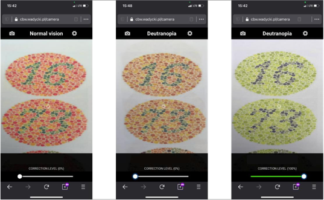

# Application of augmented reality for assistance in color vision deficiency

### BSc thesis project

Application of augmented reality for assistance in color vision deficiency thesis Includes information on color perception defects, introduction to augmented reality using WebGL technology.
Color vision deficiency (CVD) is a common problem that affects about 300 million people in the world. The thesis describes problem of color perception and the adversity that people with color blindness have to face every day.
The application with use of augmented reality and phone built-in camera helps people with color blindness using to recognize different colors and objects. The problem of color recognition is complicated by the variety of stage and type of defect.
The problem that the app solves is an important motivating factor because of the number of people affected and the functioning of a world in which colors play an important role. On the other hand, it was a desire to develop in the field of augmented reality, the use of which is becoming more popular, provides more opportunities and is a technology available to everyone using only a smartphone.
<br/><br/><br/>



### Accessibility:

The application is available on my private domain https://cbw.wadycki.pl.
To run application locally, please follow requirements and instruction below.

### Available CVD corrections:

-   Protanopia
-   Deutranopia
-   Tritanopia
-   Achromatopsia

### Requirements:

-   node >=12
-   npm >= 6
-   webcam access

### Run:

```bash
npm install
npm run dev
visit: http://localhost:3000
```

To access full paper please [e-mail](mailto:piotrwadycki@gmail.com?subject=[GitHub]%20CVD%20Thesis%20Paper) me.
